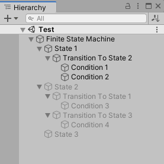

# finite-state-machine-unity

My implementation of finite state machine that utilizes Unity's GameObject hierarchy system.

## Required package
- [IrohaChiyo.Variables](https://github.com/irohachiyo/variables-unity)

## How it works

Finite State Machine has 3 main components:

1. State component.
2. Transition component. Must be added to child of State GameObject.
3. BoolVariable component. Must be added to child of Transition GameObject.

If all BoolVariable components under Transition GameObject return true, state will transition to next state.

Transitions are evaluated from top to bottom, hierarchy order. Make sure you're using transform sorting instead of alphabetical sorting.

In State component, you can specify which GameObjects are required for each state. Required GameObjects are activated/deactivated on transition if it was necessary.

There are some condition updaters included in this package. But you can also make your own condition updater. All you need to do is to update BoolVariable.Value.
